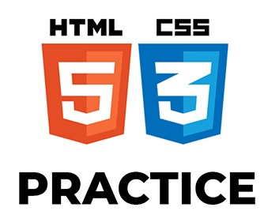

# Практика HTML и CSS "Новостная страница"

LICENSE: [MIT](./license.md)

---
Проект разработан в качестве практического задания на курсе
[_"Профессия Fullstack веб-разработчик на JavaScript и PHP"_](https://new.skillfactory.ru/web-developer-fullstack "https://new.skillfactory.ru/web-developer-fullstack")

---  
 

 

  Данный репозиторий представляет собой простейший веб сайт. Материал представлен в виде набора .html, .css, .md файлов, которые наполнены  текстовым и визуальным конентом. При создании данного сайта были использованы:

   

  
  ##  <u>Технологии</u>:

  * [HTML](https://ru.wikipedia.org/wiki/HTML "https://ru.wikipedia.org/wiki/HTML")  язык разметки 
  * [Markdown](https://en.wikipedia.org/wiki/Markdown "https://en.wikipedia.org/wiki/Markdown") облегчённый язык разметки
  * [CSS](https://en.wikipedia.org/wiki/CSS "https://en.wikipedia.org/wiki/CSS") формальный язык декодирования и описания внешнего вида документа

  * [Web-fonts (Roboto)](https://fonts.google.com/specimen/Roboto "https://fonts.google.com/specimen/Roboto") текстовый шрифт
 
 

## <u>Как открыть/запустить</u>:

Зайти в файловом менеджере в главную директорию *site*. Выбрать и зайти в папку *pages*, кликнуть 2 раза по файлу [index.html](./site/pages/index.html) или кликнуть по данной ссылке.

